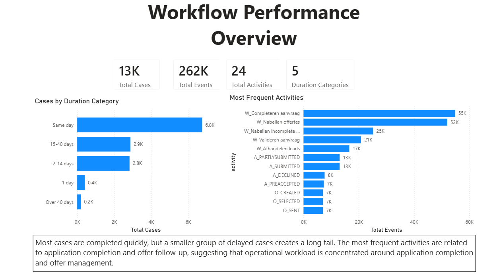
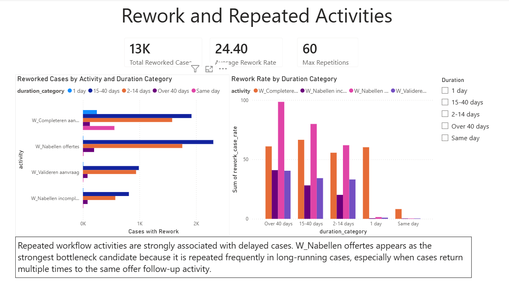
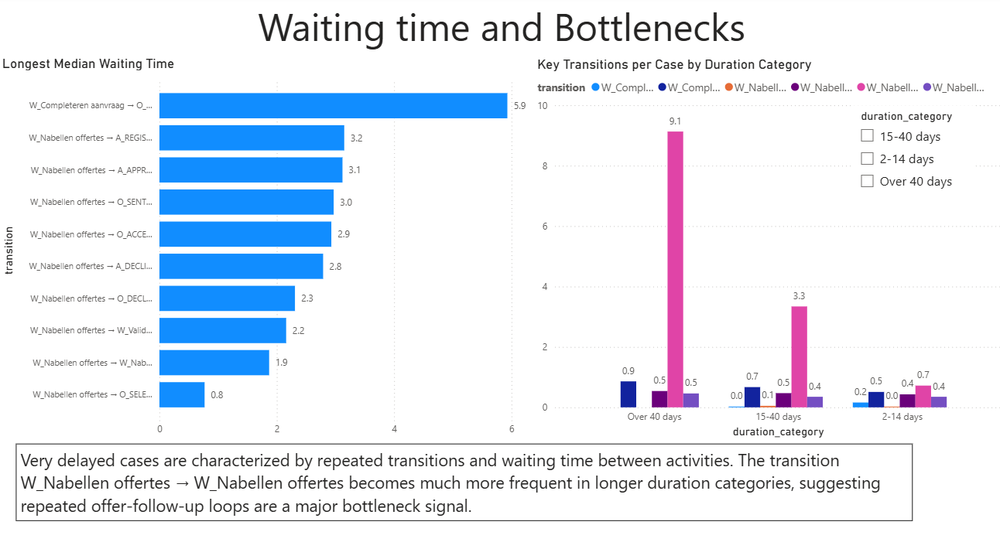
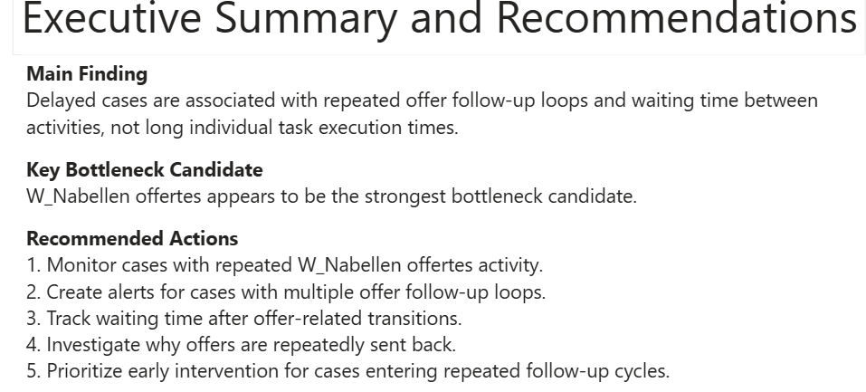

# Workflow Performance Analytics

## Project Overview

This portfolio project analyzes the **BPI Challenge 2012** event log, a real process mining dataset related to a loan application process.

The goal is to identify bottlenecks, delays, rework patterns, waiting-time issues, and process inefficiencies using Python, SQL, Streamlit, and Power BI.

## Business Problem

Loan application processes often involve multiple workflow steps, decisions, validations, offer handling, and handoffs between users or departments.

When these processes are not monitored properly, organizations may face:

* long case durations
* repeated activities and rework
* process loops
* bottleneck activities
* uneven workload distribution
* delays in decision-making

This project uses event log analysis to answer:

1. How long do loan application cases take from start to finish?
2. Which workflow activities happen most frequently?
3. Which activities are repeated more often in delayed cases?
4. Are delays caused by long task execution times or by waiting time between activities?
5. Which transitions appear most associated with delayed cases?

## Dataset

This project uses the **BPI Challenge 2012** event log.

The original dataset is available from 4TU.ResearchData and contains event data from a loan application process.

The full raw dataset is not included in this repository due to size. A small sample file is included in:

```text
data/sample/bpi_2012_events_sample.csv
```

The full dataset was downloaded locally, converted from `.xes.gz` to `.csv`, and used for the exploratory analysis and KPI generation.

The dashboards use precomputed KPI tables generated from the full dataset, allowing the repository to remain lightweight while still presenting results based on the complete event log.

## Repository Structure

```text
workflow-performance-analytics/
│
├── data/
│   ├── README.md
│   ├── kpis/
│   │   ├── activity_frequency.csv
│   │   ├── case_duration_categories.csv
│   │   ├── completed_workflow_activity.csv
│   │   ├── key_transition_comparison.csv
│   │   ├── resource_workload.csv
│   │   ├── rework_by_duration.csv
│   │   ├── rework_summary.csv
│   │   ├── waiting_time_by_duration.csv
│   │   └── waiting_time_summary.csv
│   └── sample/
│       └── bpi_2012_events_sample.csv
│
├── notebooks/
│   ├── 01_convert_xes_to_csv.ipynb
│   ├── 02_exploratory_analysis.ipynb
│   └── 03_sql_kpi_analysis.ipynb
│
├── images/
│   ├── dashboard_overview.png
│   ├── eda_activity_frequency.png
│   ├── eda_case_duration_boxplot.png
│   ├── eda_case_duration_categories.png
│   ├── eda_repetition_rate_2_14_days.png
│   ├── eda_repetition_rate_15_40_days.png
│   ├── eda_repetition_rate_over_40_days.png
│   ├── eda_transition_frequency_per_case.png
│   └── eda_median_waiting_time_by_transition.png
│
├── sql/
│   └── 01_process_kpis.sql
│
├── dashboard/
│   ├── README.md
│   └── app.py
│
├── powerbi/
│   ├── README.md
│   ├── workflow_performance_dashboard.pbix
│   └── screenshots/
│       ├── process_overview.png
│       ├── rework_analysis.png
│       ├── waiting_time_bottlenecks.png
│       └── executive_summary.png
│
├── requirements.txt
└── README.md
```

## Tools Used

* Python
* Pandas
* PM4Py
* DuckDB
* SQL
* Matplotlib
* Plotly
* Streamlit
* Power BI
* Jupyter Notebook

## Exploratory Data Analysis

The exploratory analysis was performed in:

```text
notebooks/02_exploratory_analysis.ipynb
```

The dataset contains:

* 262,200 events
* 13,087 loan application cases
* 24 unique activities
* 68 resources
* events from 2011-10-01 to 2012-03-14

## Key EDA Findings

### 1. Case Duration Distribution

Most loan application cases are completed quickly, but a smaller group takes much longer, creating a long right tail in the duration distribution.


### 2. Most Common Activities

The most frequent activities are mainly operational workflow tasks, especially activities related to application completion and offer follow-up.


### 3. Activity Repetition in Delayed Cases

Delayed cases are strongly associated with repeated workflow activities such as:

* `W_Nabellen offertes`
* `W_Completeren aanvraag`
* `W_Valideren aanvraag`
* `W_Nabellen incomplete dossiers`

However, repetition alone does not prove that these activities directly cause delays, because they are also among the most common activities in the dataset.


### 4. Task Execution Time

The activity duration analysis showed that individual workflow tasks are usually completed quickly. Most median task execution times are below one hour, and several activities have median durations of only a few minutes.

This suggests that long case durations are unlikely to be mainly caused by employees spending many hours executing individual tasks.

### 5. Waiting Time and Process Loops

The strongest finding came from the waiting-time and transition analysis.

The transition:

```text
W_Nabellen offertes → W_Nabellen offertes
```

increased strongly across duration categories:

* 0.64 transitions per case in the `2–14 days` group
* 3.23 transitions per case in the `15–40 days` group
* 9.00 transitions per case in the `Over 40 days` group

This suggests that very delayed cases are characterized by repeated offer follow-up cycles separated by waiting periods.


The waiting-time analysis also showed that some offer-related transitions have median waiting times of multiple days.


## Main EDA Conclusion

The main source of delay does not appear to be the execution time of individual workflow tasks.

Instead, delayed cases seem to be associated with:

* repeated offer follow-up cycles
* waiting time between activities
* repeated process loops
* offer-related transitions such as `O_SENT_BACK`
* repeated manual workflow activities

The activity `W_Nabellen offertes` appears to be the strongest candidate for further bottleneck investigation because it becomes much more frequent in very delayed cases.

## SQL KPI Analysis

SQL queries were created to transform the exploratory findings into reusable business KPIs.

The SQL analysis is available in:

```text
notebooks/03_sql_kpi_analysis.ipynb
sql/01_process_kpis.sql
```

The generated KPI tables are stored in:

```text
data/kpis/
```

These KPI tables support the dashboards without requiring the full event-level dataset to be included in the repository.

## Dashboards

This project includes two dashboard implementations:

1. a **Streamlit dashboard** for a lightweight interactive web application
2. a **Power BI dashboard** for business intelligence reporting

Both dashboards use precomputed KPI tables stored in:

```text
data/kpis/
```

This allows the repository to remain lightweight while still presenting results generated from the full event log.

---

### Streamlit Dashboard

A Streamlit dashboard was created to present the main workflow performance KPIs in an interactive format.

#### Streamlit Dashboard Preview


#### Live Dashboard

[Open the Streamlit dashboard](https://workflow-performance-analytics-brunopn.streamlit.app/)

Dashboard file:

```text
dashboard/app.py
```

#### Run the Streamlit Dashboard Locally

From the root of the project folder, run:

```bash
streamlit run dashboard/app.py
```

The Streamlit dashboard includes:

* process overview KPIs
* case duration categories
* most frequent activities
* rework by duration category
* transition frequency per case
* median waiting time by transition
* resource workload
* main business insight

---

### Power BI Dashboard

A Power BI dashboard was also created to present the analysis in a business intelligence format.

The Power BI report is available in:

```text
powerbi/workflow_performance_dashboard.pbix
```

The report includes four pages:

1. **Process Overview**
2. **Rework Analysis**
3. **Waiting Time & Bottlenecks**
4. **Executive Summary and Recommendations**

#### Power BI Dashboard Screenshots









### Dashboard Purpose

The dashboards translate the EDA and SQL KPI analysis into business-facing monitoring tools.

They highlight that delayed cases appear to be driven more by repeated follow-up cycles and waiting time between activities than by long individual task execution times.

## Business Recommendations

Based on the analysis, the organization should monitor repeated offer follow-up cycles as a key process risk.

The strongest bottleneck candidate is `W_Nabellen offertes`, especially when the same case returns repeatedly to this activity. Very delayed cases show a much higher number of `W_Nabellen offertes → W_Nabellen offertes` transitions per case, suggesting that repeated offer follow-up is a major signal of long-running applications.

Recommended actions include:

1. Create alerts for cases with repeated offer follow-up activity.
2. Monitor cases that exceed a defined number of `W_Nabellen offertes` repetitions.
3. Track waiting time after offer follow-up activities.
4. Investigate why offers are repeatedly sent back or require multiple follow-ups.
5. Use the dashboards to identify cases that are likely to become delayed before they reach extreme durations.

These recommendations should be interpreted as process-monitoring suggestions rather than causal conclusions. The analysis identifies strong associations between repeated follow-up cycles, waiting time, and delayed cases.

## Next Steps

Potential future improvements include:

1. Add predictive modeling for delayed case risk
2. Compare process variants between short and delayed cases
3. Add more interactive filtering to the dashboards
4. Create automated alerts for cases with repeated offer follow-up loops
5. Improve dashboard styling and add additional business KPI views

## Portfolio Purpose

This project is part of my data portfolio and is designed to demonstrate:

* event log analysis
* exploratory data analysis
* SQL-based KPI creation
* process analytics
* bottleneck investigation
* business recommendations
* Streamlit dashboard development
* Power BI dashboard development
* data storytelling
