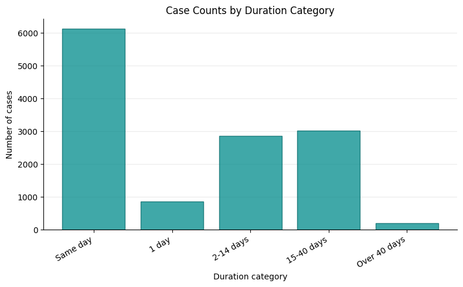
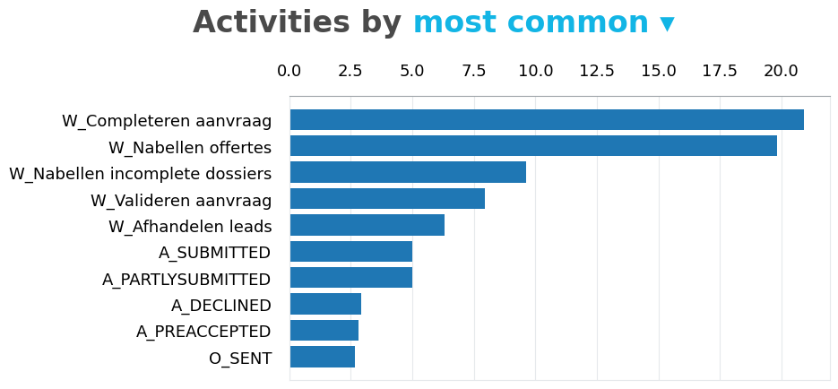
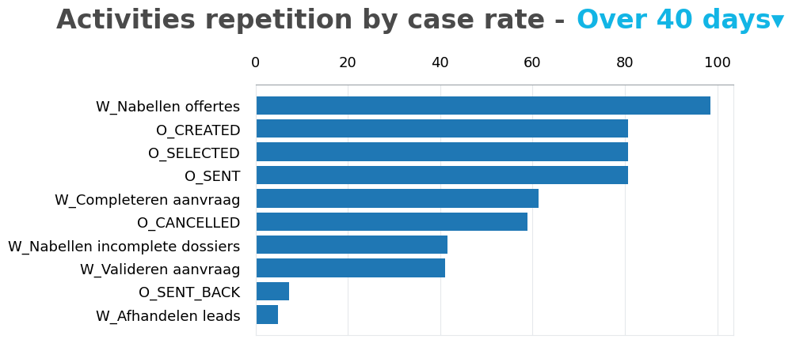
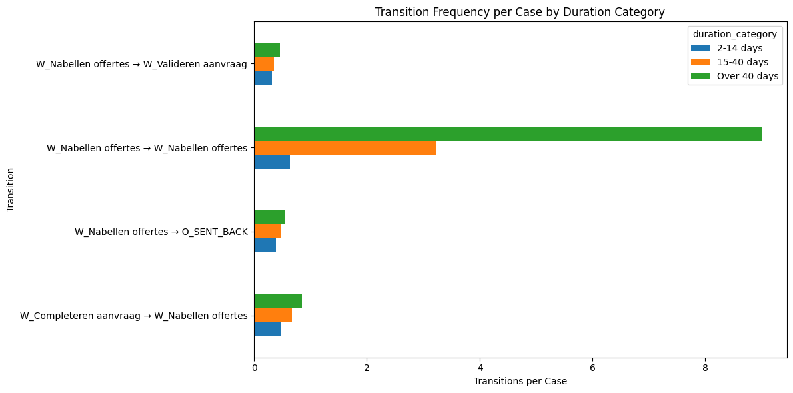
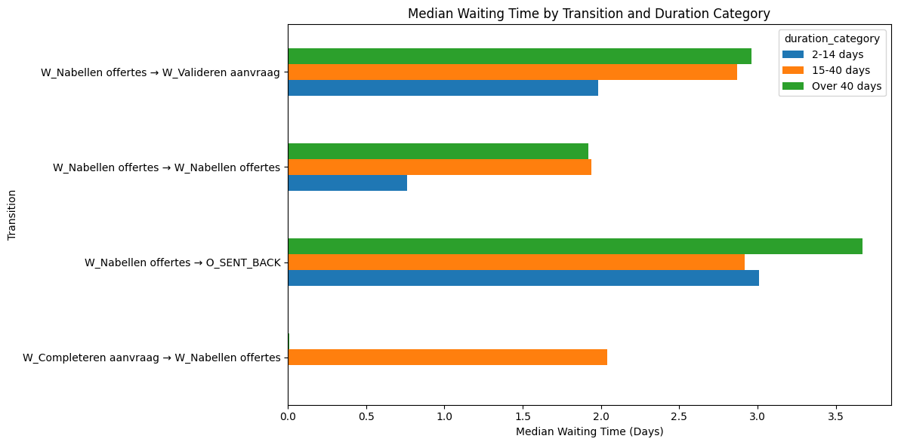
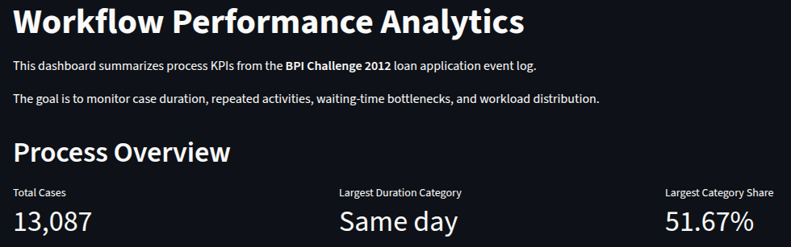

# Workflow Performance Analytics

## Project Overview

This portfolio project analyzes the **BPI Challenge 2012** event log, a real process mining dataset related to a loan application process.

The goal is to identify bottlenecks, delays, rework patterns, waiting-time issues, and process inefficiencies using Python, SQL, and dashboarding.

## Business Problem

Loan application processes often involve multiple workflow steps, decisions, validations, offer handling, and handoffs between users or departments.

When these processes are not monitored properly, organizations may face:

* long case durations
* repeated activities and rework
* process loops
* bottleneck activities
* uneven workload distribution
* delays in decision-making

This project uses event log analysis to answer:

1. How long do loan application cases take from start to finish?
2. Which workflow activities happen most frequently?
3. Which activities are repeated more often in delayed cases?
4. Are delays caused by long task execution times or by waiting time between activities?
5. Which transitions appear most associated with delayed cases?

## Dataset

This project uses the **BPI Challenge 2012** event log.

The original dataset is available from 4TU.ResearchData and contains event data from a loan application process.

The full raw dataset is not included in this repository due to size. A small sample file is included in:

```text
data/sample/bpi_2012_events_sample.csv
```

The full dataset was downloaded locally, converted from `.xes.gz` to `.csv`, and used for the exploratory analysis.

## Repository Structure

```text
workflow-performance-analytics/
│
├── data/
│   ├── README.md
│   └── sample/
│       └── bpi_2012_events_sample.csv
│
├── notebooks/
│   ├── 01_convert_xes_to_csv.ipynb
│   └── 02_exploratory_analysis.ipynb
│
├── images/
│   ├── eda_activity_frequency.png
│   ├── eda_case_duration_boxplot.png
│   ├── eda_case_duration_categories.png
│   ├── eda_repetition_rate_2_14_days.png
│   ├── eda_repetition_rate_15_40_days.png
│   ├── eda_repetition_rate_over_40_days.png
│   ├── eda_transition_frequency_per_case.png
│   └── eda_median_waiting_time_by_transition.png
│
├── sql/
├── src/
├── dashboard/
├── requirements.txt
└── README.md
```

## Tools Used

- Python
- Pandas
- PM4Py
- DuckDB
- SQL
- Matplotlib
- Plotly
- Streamlit
- Jupyter Notebook

## Exploratory Data Analysis

The exploratory analysis was performed in:

```text
notebooks/02_exploratory_analysis.ipynb
```

The dataset contains:

* 262,200 events
* 13,087 loan application cases
* 24 unique activities
* 68 resources
* events from 2011-10-01 to 2012-03-14

## Key EDA Findings

### 1. Case Duration Distribution

Most loan application cases are completed quickly, but a smaller group takes much longer, creating a long right tail in the duration distribution.



### 2. Most Common Activities

The most frequent activities are mainly operational workflow tasks, especially activities related to application completion and offer follow-up.



### 3. Activity Repetition in Delayed Cases

Delayed cases are strongly associated with repeated workflow activities such as:

* `W_Nabellen offertes`
* `W_Completeren aanvraag`
* `W_Valideren aanvraag`
* `W_Nabellen incomplete dossiers`

However, repetition alone does not prove that these activities directly cause delays, because they are also among the most common activities in the dataset.



### 4. Task Execution Time

The activity duration analysis showed that individual workflow tasks are usually completed quickly. Most median task execution times are below one hour, and several activities have median durations of only a few minutes.

This suggests that long case durations are unlikely to be mainly caused by employees spending many hours executing individual tasks.

### 5. Waiting Time and Process Loops

The strongest finding came from the waiting-time and transition analysis.

The transition:

```text
W_Nabellen offertes → W_Nabellen offertes
```

increased strongly across duration categories:

* 0.64 transitions per case in the `2–14 days` group
* 3.23 transitions per case in the `15–40 days` group
* 9.00 transitions per case in the `Over 40 days` group

This suggests that very delayed cases are characterized by repeated offer follow-up cycles separated by waiting periods.



The waiting-time analysis also showed that some offer-related transitions have median waiting times of multiple days.



## Main EDA Conclusion

The main source of delay does not appear to be the execution time of individual workflow tasks.

Instead, delayed cases seem to be associated with:

* repeated offer follow-up cycles
* waiting time between activities
* repeated process loops
* offer-related transitions such as `O_SENT_BACK`
* repeated manual workflow activities

The activity `W_Nabellen offertes` appears to be the strongest candidate for further bottleneck investigation because it becomes much more frequent in very delayed cases.

## Dashboard

A Streamlit dashboard was created to present the main workflow performance KPIs in an interactive format.

### Dashboard Preview



### Live Dashboard

[Open the Streamlit dashboard](https://workflow-performance-analytics-brunopn.streamlit.app/)

The dashboard uses precomputed KPI tables stored in:

```text
data/kpis/
```

This means the dashboard can run without requiring the full event-level dataset to be included in the repository.

Dashboard file:

```text
dashboard/app.py
```

### Run the Dashboard Locally

From the root of the project folder, run:

```bash
streamlit run dashboard/app.py
```

The dashboard includes:

* process overview KPIs
* case duration categories
* most frequent activities
* rework by duration category
* transition frequency per case
* median waiting time by transition
* resource workload
* main business insight

### Dashboard Purpose

The dashboard translates the EDA and SQL KPI analysis into a business-facing monitoring tool.

It highlights that delayed cases appear to be driven more by repeated follow-up cycles and waiting time between activities than by long individual task execution times.

## Next Steps

The next stages of the project are:

1. Create SQL queries for process KPIs
2. Build reusable Python metric functions
3. Develop a dashboard for workflow monitoring
4. Add business recommendations based on the analysis

Planned dashboard metrics include:

* total cases
* average and median case duration
* delayed case rate
* most repeated activities
* transition frequency per case
* median waiting time by transition
* resource workload

## Portfolio Purpose

This project is part of my data portfolio and is designed to demonstrate:

* event log analysis
* exploratory data analysis
* process analytics
* business KPI creation
* bottleneck investigation
* data storytelling
* dashboard planning
